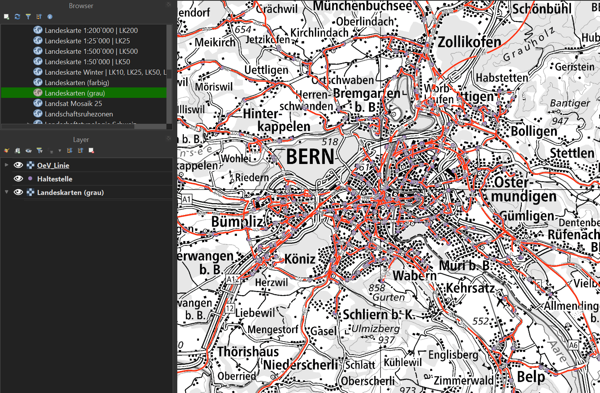

# Dokumentation Nacharbeit:
Anmerkung vor dem Lesen: Im Edit-Modus sind die Linebreaks korrekt. Jeder Abschnitt ist in sich chronologisch, wobei jeweils der erste Satz dokumentiert wurde als die Problemsstellung aus sicht der Ausgangslage angegangen wurde und der letzte Satz jedes Abschnittes wurde nach der Problemlösung geschrieben. Die 6 Schritte geben soweit einen Überblick über die verschiedenen Arbeitsstränge, wobei Schritte 1,2, 6 und 7 im vergleich klein waren, Schritte 3-5 dagegen waren herausforderungsvoll und wurden synchron gelöst.

## 1.) Repo clonen und zur verfügung stellen

## 2.) Datensätze aussuchen: 
Ein WM(T)S und ein WFS, gewünscht wären sämmtliche ÖV-Linien und Haltestellen über die gesammte Schweiz. Leider gibt es solche Datensätze nicht. Deswegen wurde diese Funktionalität für Demo-Zwecke auf den Ballungsraum Bern beschränkt: 
https://opendata.swiss/de/dataset/ov-linien
https://opendata.swiss/de/dataset/ov-haltestellen

Die beiden Services wurden in QGis testweise eingebunden, wie in "Datenvisualisierung.png" zu sehen ist:

https://map.bern.ch/arcgis/services/Geoportal/Haltestellen/MapServer/WFSServer
https://map.bern.ch/arcgis/services/Geoportal/OeV_Linien/MapServer/WMSServer?request=GetCapabilities&service=WMS.
Wie in Schritt 3 erwähnt, wurde der Anbieter für den WFS gewechselt, da dieser der Stadt Bern aus berechtigungsproblemen nicht verwendet werden konnte.


## 3.) Geoserver konfigurieren, WMS und WFS einbinden, konfigurieren, veröfentlichen und testen.

### WMS
WMS läuft auf anhieb ohne Probleme.
WFS läuft im QGis test. Im Geoserver nicht. Über die Netzwerkdiagnose wurde in QGis der Link zu den GetCapabilities herausgefunden, welcher ansonsten versteckt war. Leider wieder kein Erfolg.

Aus einem nicht herausgefundenen Grund kann ich die in QGIS und im Browser funktionierende GetCapabilities URL zwar in der erstellung des Datastore angeben, im Log des Errors beim Preview kommt jedoch heraus, dass es eine andere url abfragt.

In der Layerdefinition kann definiert werden, dass die Koordinaten von LV95 auf Web-Mercator Projeziert werden sollen.
So läuft der WMS nun (auch in QGIS), eine  Beispielabfrage im Browser ist hiermit möglich: Wichtigstes Learning war hierbei, dass der Layername vor allem über den Workspace definiert wird!
http://localhost:8080/geoserver/wms?service=WMS&version=1.1.1&request=GetMap&layers=ne:0&bbox=821802.7469837219,5615499.530783547,860986.6866042244,5919283.470404049&width=256&height=256&srs=EPSG:3857&format=image/png

### WFS
Der WFS lief lange nicht auf dem Geoserver. Schlussendlich konnte ich die getCapabilities abrufen:
http://localhost:8080/geoserver/wfs?request=GetCapabilities
Im Nachhinein habe ich festgestellt, dass ich auf den Vorlagen der Geoserver-Übung aufgebaut habe, wesshalb noch viele Artefakte übrig sind. 
Auch hier bekomme ich ständig Errorcodes 403 (Forbidden). Das würd heissen, dass der Geoserver den WFS der Stadt Bern nichz beziehen darf.
In QGis funktioniert das hinzufügen wunderbar, desshalb verstehe ich nicht, wieso das mit dem Geoserver nicht funktionieren sollte...

Es wurde nun entschieden, den WFS Anbieter zu wechseln, was auch auf anhieb funktionierte:
Der GetCapabilities des Ursprunges: https://ch-osm-services.geodatasolutions.ch/geoserver/ows?service=wfs&version=2.0.0&request=GetCapabilities
Der GetCapabilities des Geoservers: http://localhost:8080/geoserver/wfs?request=GetCapabilities
Mein Geoserver funktioniert: http://localhost:8080/geoserver/wfs?service=WFS&version=1.1.0&request=GetFeature&typeName=ne:magosm_bus_routes_line&outputFormat=application/json&srsname=EPSG:3857&bbox=812000,5900000,826000,5920000
Um die Effizienz im Produkt besser zu machen, wurde zusätzlih zu den Buslinien die Eisenbahnlinien publiziert.

## 4.) Integration im Backend von WMS und WFS:

Pipeline ist nun:
Extern (Stadt Bern) -> Geoserver (mit Transformation) -> Backend -> Frontend

Bestehen bleibt die Pipline der bisherige API's:
geOps -> Backend -> Frontend
Leider funktioniert dieser nicht mehr da die API unseren Zugrif nicht mehr gestattet.
Auch mit einem neuen API-Key funktioniert diese API leider nicht mehr für das Projekt, der Code läuft soweit.

### WMS

Nachdem der WMS Dienst auf dem Geoserver funktionierte, konnte er auch im Backend zum laufen gebracht werden. Wenn das Backend auf Localhost:8000 läuft funktioniert folgende Abfrage:
Beispielabfrage: http://localhost:8000/wms/?layers=ne:0&bbox=821802.7469837219,5615499.530783547,860986.6866042244,5919283.470404049&width=256&height=256
Um die Effizienz im Produkt besser zu machen, wurde von den Buslinien zu den Eisenbahnlinien gewechselt.

### WFS

Die Implementation des WFS Dienstes im Backend ergab sich analog zum WMS sehr schnell und ohne weitere Hindernisse. Anzumerken ist hierbei möglicherweise, dass der Endpunkt nicht länger als eine Minute arbeiten darf, da er sonst geblockt wird. Das heisst die bbox ist dementsprechend klein zu wählen. In gewissen Fällen geht es aber dennoch, also ist diese Linie keine harte.
Beispielabfrage: http://localhost:8000/wfs/?bbox=827000,5930000,830000,5936000

## 5.) Integration im Frontend

### WMS

npm install gibt warnings und npm run gibt macht nicht was man benötigt. So kann das App nicht lokal getestet werden.
Das Problem lag am Pfad des Repos im Onedrive-Ordner. Nach einer Verschiebung auf ein tieferes Ordnerlevel ohne Leerschläge gibt es keine Probleme mehr, das Frontend zu starten.
Das Frontend könnte auf die bisherigen, von GeOps gespiessenen API's zugreifen, würden diese nicht blockiert werden.
Stand jetzt funktioniert die Abfrage vom eigenen WMS im Backend noch nicht.

Eine neue Funktion createCustomWMSLayer wurde geschrieben um mit diesem call:
currentMap.addLayer(createCustomWMSLayer(), { zIndex: Infinity });
den WMS vom Backend abzurufen. Leider funktioniert das nicht auf anhieb. Es wurde versucht, mit Logging den Fehler zu eruieren. Die URL scheint defekt zu sein.
Beim neuen Verwenden funktionierte es plötzlich, aber erst nach einem Update auf der Map über die Checkboxen.

### WFS

initializeMap wurde angepasst, dass die neue const createWfsLayer aufgerufen werden sollte, leider zeigt sich nichts im Test und auch in der Konsole sehe ich nirgends ein Log, das die Funktion ausgeführt wurde.

Auf Hinweis von E.Eberlein habe ich mich an meinen Komillitonen T.v.Felten gewandt. Er hat mir versichert, dass es fast aussichtslos ist den "spaghetti-code" des Frontends so anzupassen, dass es ich die Daten visualisieren kann. Er Empfahl, eine neue React-App aufzusetzen, in der das im Mail von P.Bereuter definierte Ziel der Visualisuerung umsetzbar ist. Ein grosser Verlust ist dies nicht, da die Funktionalität der App über den Verlust der GeOps API ja onehin schon verloren war.

## 5.1) Neue React-App als Frontend.

Es wird eine React App im Client2 geschaffen, welche im Hintergrund das Swissimage darstellen soll und darauf den WMS und WFS abbilden soll.
Dabei war wichtig, das gitignore zu updaten!
Es wurde geschaut dass die minimalsten Funktionen, die im Client noch giengen auch im Client2 vorhanden sind. Das wäre das panning & zooming, sowie die Layerwahl.

### WMS

Da nun der ganze Rahmen einfach, übersichtlich und verständlich ist, konnte der WMS hinzugefügt werden. Ein Einfrieren konnte mit den Funktionen "params" und "updateparams" gelöst werden


### WFS


react app
darstellung wfs wms
zerst struktur
openlayers - leaflet

## 6.) Reflexion der Änderungen:

Ernüchternderweise hat sich in der Nacharbeit herausgestellt, dass ich mit meiner Konfiguration von Code, Key, PC etc. keinen Zugriff mehr habe zur GeOps-API. Deshalb musste auf die eigentliche Funktionalität der App leider verzichtet werden. Somit war die Nacharbeit eine eher trockene Übung um zu zeigen, dass die gefordeten Kompetenzen angewendet werden konnten.

Die Überarbeitung war insofern ein anspruchvolles, eigenständiges Projekt, da es für mich Neuland war, ein Testat nicht zu erhalten. Somit ist mit der Gefährdung des Studienabschlusses ein zusätzlicher psychischer udn emotionaler Stress auf meinen Schultern gelandet, der mir zwischen Hochzeits-, Ehe- und "Leben-danach"-Vorbereitungen nicht eigentlich gefehlt hat. Allerdings war schwarz auf weiss klar, dass dieses Projekt, was im Semester entstand, aufgrund diversen Punkten nicht Testatwürdig war.

Nach nun 18-20 Stunden nacharbeit habe ich einiges nochmals gelernt. Geoserver konfigurieren und Python-backend konnte ich zwar schon, aber durch die Erweiterungen in dieser Überarbeitung habe ich meine Kenntnisse gefestigt. Meine grosse Schwäche liegt in JavaScript. Ich habe den Dreh bei M. Christen nie ganz herausgekriegt und deswegen auch im Semester die Implementation der Backends, die Abfrage der API, die Architektur zwischen Frontend & Backend sowie alles was mit dem Raspi zu tun hat übernommen. Also alles, was nicht JSX ist. Das wurde nun natürlich zum Verhängnis, wo ich das Frontend so anpassen wollte, dass es die zusätzlichen Layer anzeigt. Auch ChatGPT und Copilot konnten mit hierbei nicht wirklich helfen.

Dennoch bin ich schlussendlich zu einem Ergebnis gekommen, welches die Anforderungen erfüllt. Mir ist klar geworden, dass Softwareentwicklung ein interesantes Gebiet ist, aber für meine Interessen und Kompetenzen nicht als Hauptberufsfeld infrage kommen.

## 7.) Kontrolle der Nacharbeit auf Vollständigkeit gemäss Mail von P.Bereuter

Mit dem Schreiben dieser Zeilen Bestätige ich:
- Dass ich die Überarbeitung selbständig in Einzelarbeit durchgeführt habe. Erst auf Aufforderung von S.Ebrelein habe ich meine Komillitonen um Rat gefragt bezüglich meinen Frontend-Problemen.
- Vor KW32 die Überarbeitung abgegeben habe.
- Die Überarbeitung in diesem Readme passend dokumentiert habe.
- Die im Mail genannten, zu überarbeitenden Punkte nach bestem Wissen und Gewissen implementiert habe. Hierbei habe ich:
* mehrere unterschiedliche Dienste im Geoserver hinzugefügt, bis ein WMS und ein WFS funktionierte
* Diesen WMS und WFS in einem Backend-Endpoint eingegliedert
* Die Daten im Frontend visualisert.
* Alle Codes so gestalltet, dass sie in der lokalen Umgebung verwendbar sind.
* Die angeforderten Diagramme überarbeitet und im Readme eingebunden.
* Screenshots des Geoservers hinzugefügt.
* ein Kapitel der Änderungen und Verbesserungen gewidmet.


# Bestehende Dokumentation bei erster Abgabe
# ÖV-Now

## Beschreibung
ÖV-Now ist eine App, die Sie über den Verkehr auf dem Laufenden hält, so dass Sie immer die beste Route wählen können.
Die Details entnehmen sie unserer GitHub [Page](Mattia-V01.github.io/ov-now/)


## Installation
1. Klone das Repository auf deinen Computer:
   ```
   git clone git@github.com:benutzername/ov-now.git
   ```
2. Navigiere in das Hauptverzeichnis des Projekts:
   ```
   cd ..\ov-now\client
   ```
3. Installiere die Abhängigkeiten:
   ```
   npm install
   ```

## Konfiguration
löschen vor Abgabe wenn nichts reinkommt.

## Backend
diese Anleitung richtet sich an die Inbetriebnahme des Backends auf dem Raspberry 4 des IGEO:

1.) Raspi starten udn einrichten, d.h. Internetverbindung aufbauen (in diesem Fall mit Handy HotSpot da Raspy nicht ins FH-Netz kommt)

2.) Bash öffnen und zu gewünschtem Root-Verzeichnis navigieren (cd /home/USER/documents)

3.) git clone https://github.com/Mattia-V01/ov-now.git

4.) python -m venv backend

5.) source backend/bin/activate

6.) sudo apt-get install python3-dev

7.) pip install --upgrade setuptools

8.) pip3 install starlette

9.) pip3 install fastapi

10.) pip3 install uvicorn

11.) pip3 install requests

12.) python cd /home/USER/documents/ov-now/server/app/backend.py
-> Beispielabfragen aus den Comments kopieren und ausprobieren. (wobei Beispielabfrage für Endpoint1 18minuten dauerte)


13.) sudo raspi-config 
SSH aktivieren

14.) setup SSH Verbindung: ip a 
unter drittens wlan0 inet ist die ip zu finden

15.) cd ov-now/server/app

16.) uvicorn backend:app --host 0.0.0.0 --port 8000

##nutzendes Gerät

50.) Auf nutzendem Gerät: cmd öffnen und eingeben:
ssh kuhnt@192.168.126.44
password = password

51.) hostname -I
gibt IP zurück falls nicht vorhanden zum Copy Pasten

51.)  "http://192.168.126.44:8000/get_all_journey/?bbox=838667,5997631,909982,6036843&key=5cc87b12d7c5370001c1d65576ce5bd4be5a4a349ca401cdd7cac1ff&zoom=12"

52.)  "http://192.168.126.44:8000/get_info/?train_id=sbb_140523186358112&key=5cc87b12d7c5370001c1d65576ce5bd4be5a4a349ca401cdd7cac1ff"


## Verwendung
1. Öffne deinen Browser und gehe zu `http://localhost:3000`.
2. 
3. 
4. 

